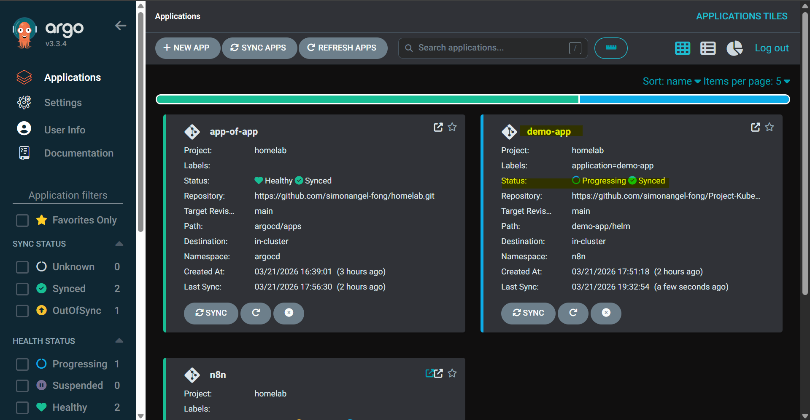
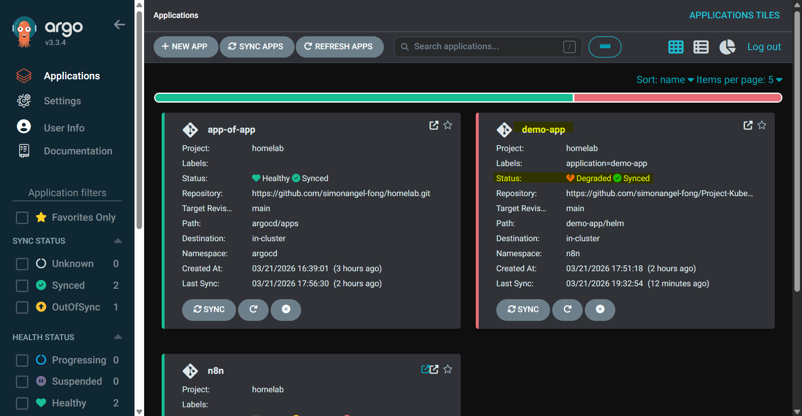
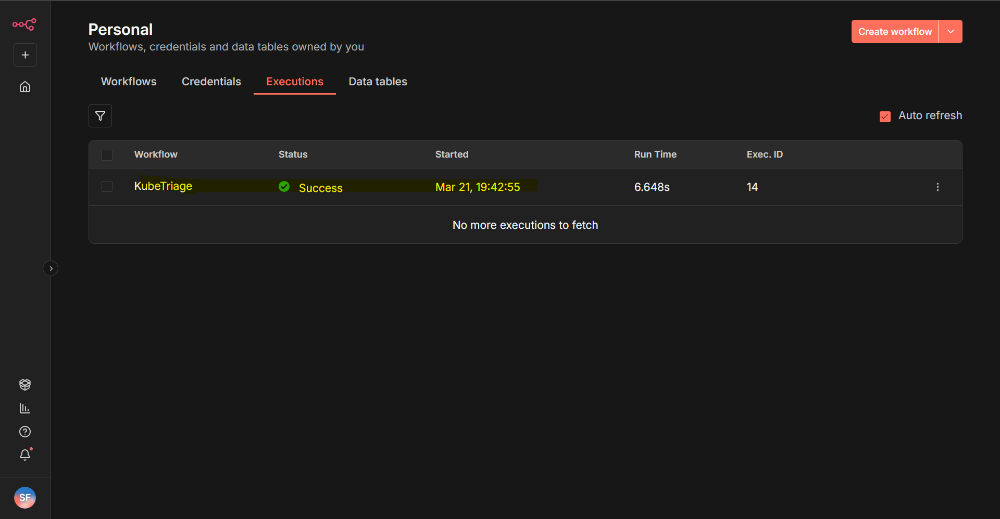
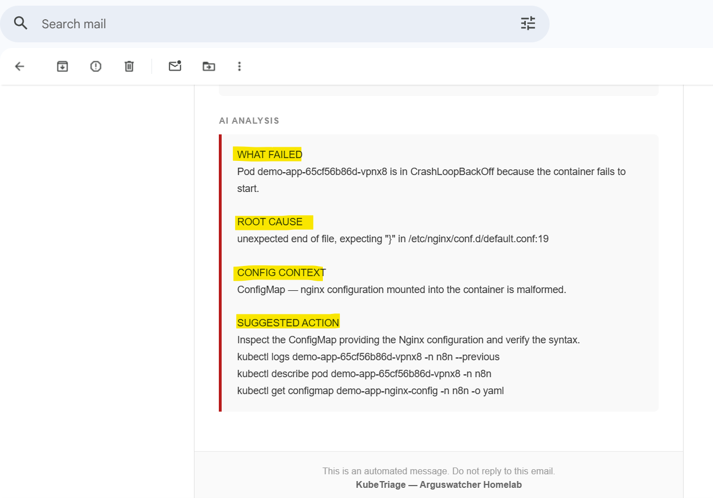
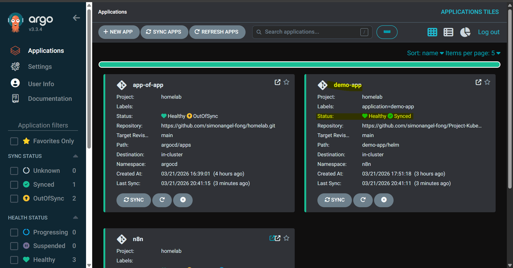

# KubeTriage: n8n Proof of Concept Demo

[Back](../../README.md)

- [KubeTriage: n8n Proof of Concept Demo](#kubetriage-n8n-proof-of-concept-demo)
  - [n8n Workflow](#n8n-workflow)
  - [How it works](#how-it-works)
    - [🟢T0: Healthy Deployment](#t0-healthy-deployment)
    - [🟡T1: Sync for Update](#t1-sync-for-update)
    - [🔴T2: Degraded Deployment and Triage Notification](#t2-degraded-deployment-and-triage-notification)
    - [🟢T3: Bugfix and Recovery](#t3-bugfix-and-recovery)

---

## n8n Workflow

---

## How it works

`KubeTriage` monitors `ArgoCD` application health and automatically triggers a triage workflow when a deployment degrades. The workflow collects context, generates a summary report, and notifies the team — rdelivering an AI-generated triage report to the on-call engineer.

---

### 🟢T0: Healthy Deployment

Application is running and healthy.

---

### 🟡T1: Sync for Update

A new version (containing a misconfigured configmap) is committed, pushed, and synced to the cluster.

---

### 🔴T2: Degraded Deployment and Triage Notification

ArgoCD detects the deployment as Degraded and fires a webhook to n8n (via ArgoCD Notifications)

The n8n workflow is triggered and generates a triage summary report.

The report is delivered by email.

---

### 🟢T3: Bugfix and Recovery

The bug is fixed, committed, and the application is resynced. Health is restored.

See [Rollback and Sync CLI reference](../docs/argocd_cli.md) for the recovery commands used.

---
