# KubeTriage: Kagent — Human-in-the-Loop Demo

[Back](../../README.md)

- [KubeTriage: Kagent — Human-in-the-Loop Demo](#kubetriage-kagent--human-in-the-loop-demo)
  - [`hitl-agent` Configuration](#hitl-agent-configuration)
  - [`hitl-agent` Demo](#hitl-agent-demo)
    - [Healthy Deployment](#healthy-deployment)
    - [ImagePullBackOff](#imagepullbackoff)
    - [ConfigMap Error](#configmap-error)
    - [CrashLoopBackOff](#crashloopbackoff)

---

## `hitl-agent` Configuration

- Model: `claude-haiku-4-5`
- Agent Instructions(Default)

```txt
You are a Kubernetes management agent. You help users inspect and manage resources in the cluster. Before making any changes, explain what you plan to do. If the user's request is ambiguous, use the ask_user tool to clarify before proceeding.
```

- **Prompt** — Request introduction

```txt
Summarize the deployment into a table in the default namespace.
```

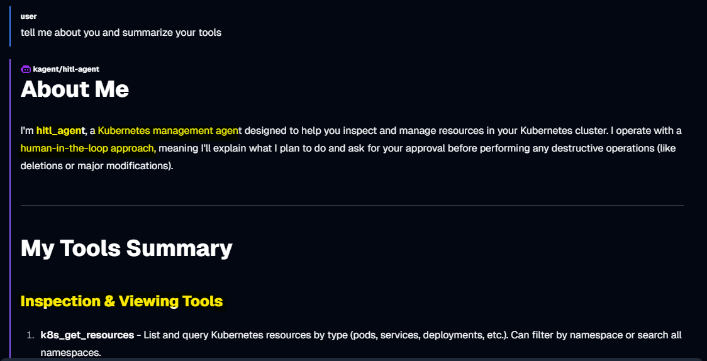

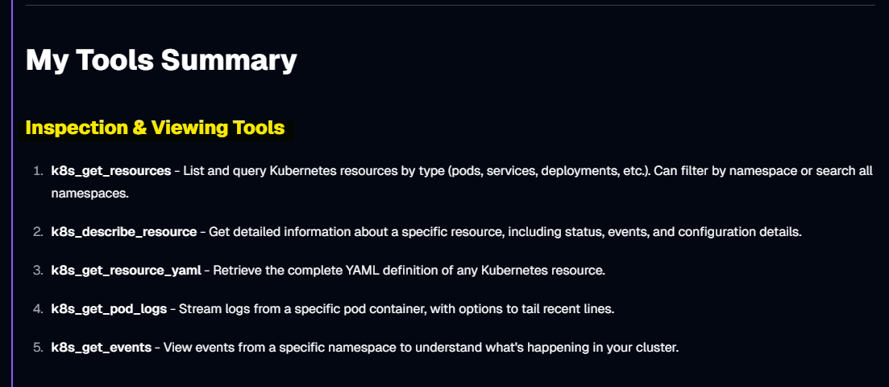

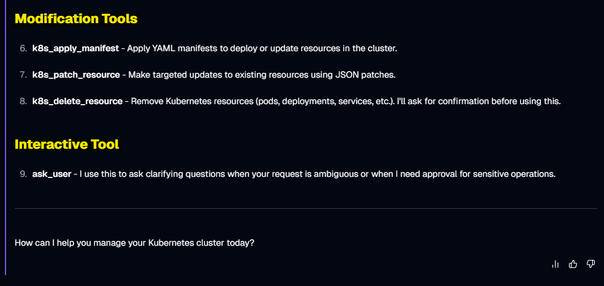

---

## `hitl-agent` Demo

### Healthy Deployment

- Apply

```sh
kubectl apply -f 00_demo-app/manifests/01_healthy.yaml
# deployment.apps/nginx created
# service/nginx created
```

- **Prompt 1** — Request report

```txt
Summarize the deployment into a table in the default namespace.
```

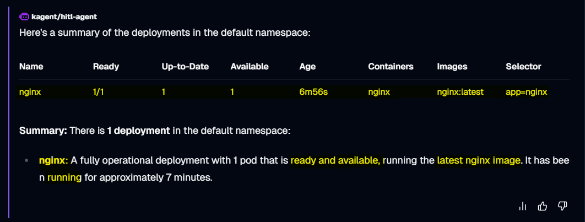

---

### ImagePullBackOff

Simulates a deployment referencing a non-existent image tag, triggering an `ImagePullBackOff` error.

```sh
kubectl apply -f 00_demo-app/manifests/02_imagepull.yaml
# deployment.apps/nginx-imagepull created
```

- **Prompt 1** — Request report

```txt
Summarize the deployment into a table in the default namespace.
```

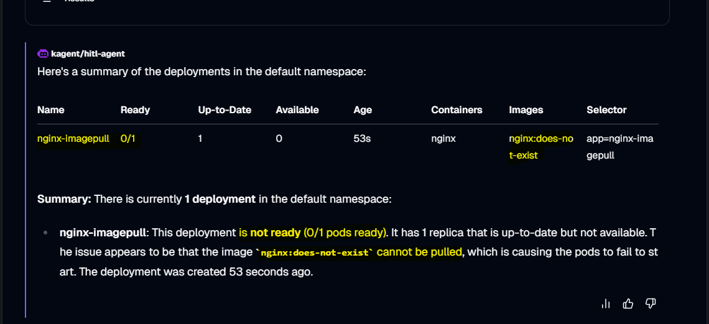

- **Prompt 2** — Request fix

```txt
Help me fix it.
```

- Question to choose image

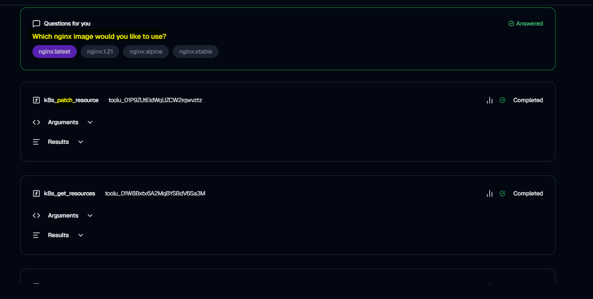

- Final output
  Summary of change

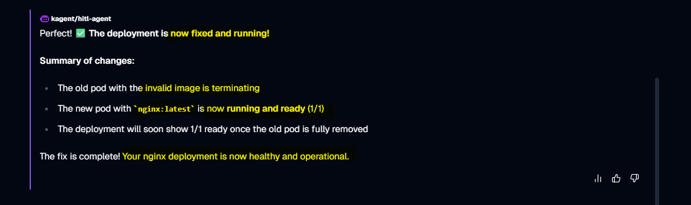

- Confirm
  Verify fix applied correctly via kubectl


---

### ConfigMap Error

Simulates a deployment referencing a non-existent ConfigMap, triggering an `CreateContainerConfigError` error.

```sh
kubectl apply -f 00_demo-app/manifests/03_configerror.yaml
# deployment.apps/nginx-configerror created
```

- **Prompt 1** — Request report

```txt
Summarize the deployment into a table in the default namespace.
```

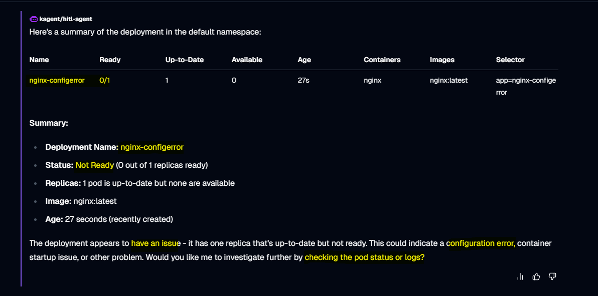

- **Prompt 2** — Request diagnosis

```txt
Yes
```

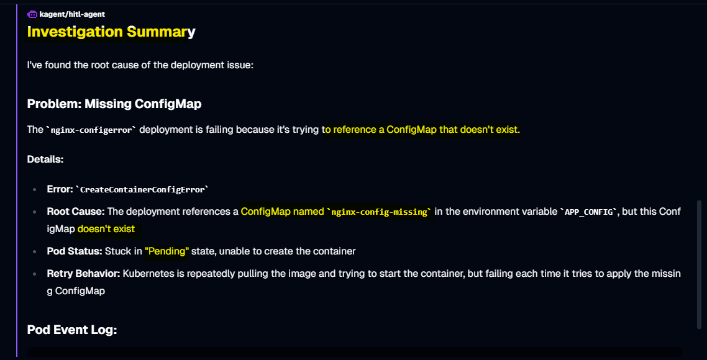

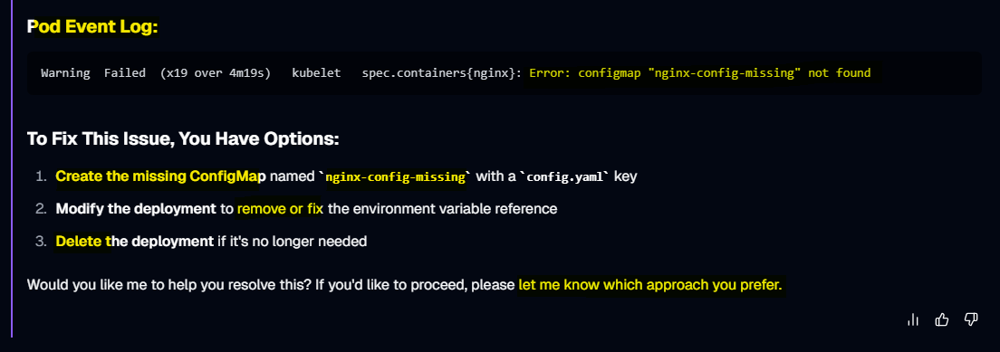

- **Prompt 2** — Request fix

```txt
Fix it by removing environment variable reference
```

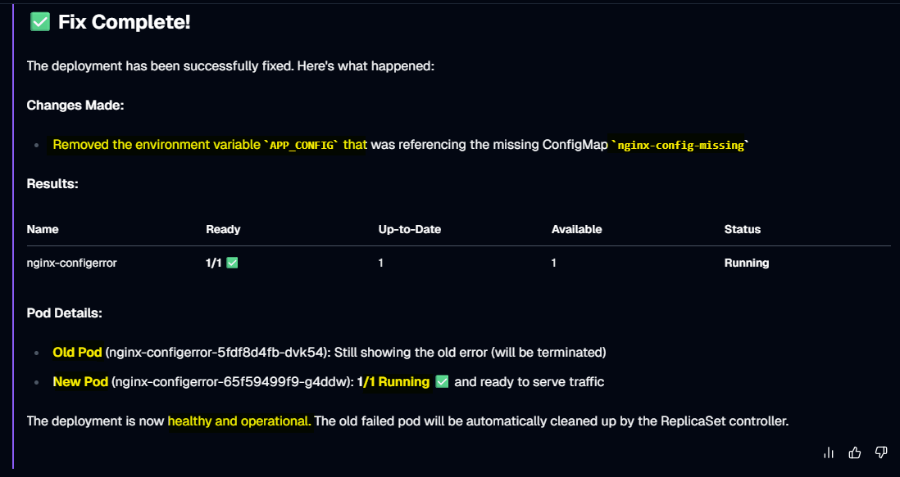

- Confirm
  Verify fix applied correctly via kubectl

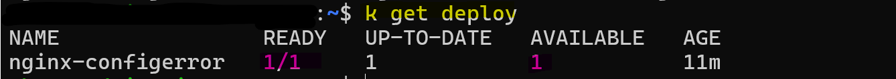

---

### CrashLoopBackOff

Simulates a deployment executing `exit 1`, triggering an `CrashLoopBackOff` error.

```sh
kubectl apply -f 00_demo-app/manifests/04_crashloop.yaml
# deployment.apps/nginx-crashloop created
```

- **Prompt 1** — Request report

```txt
Summarize the deployment into a table in the default namespace.
```

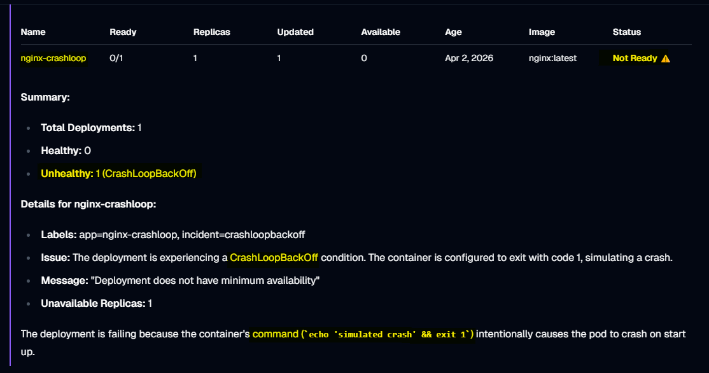

- **Prompt 2** — Request fix

```txt
Help me fix it.
```

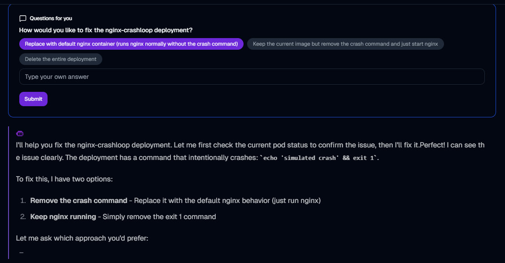

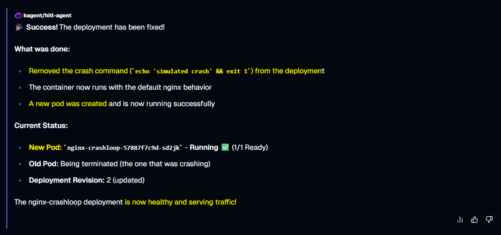

- Confirm
  Verify fix applied correctly via kubectl

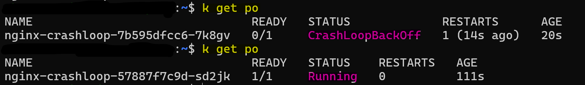

---
