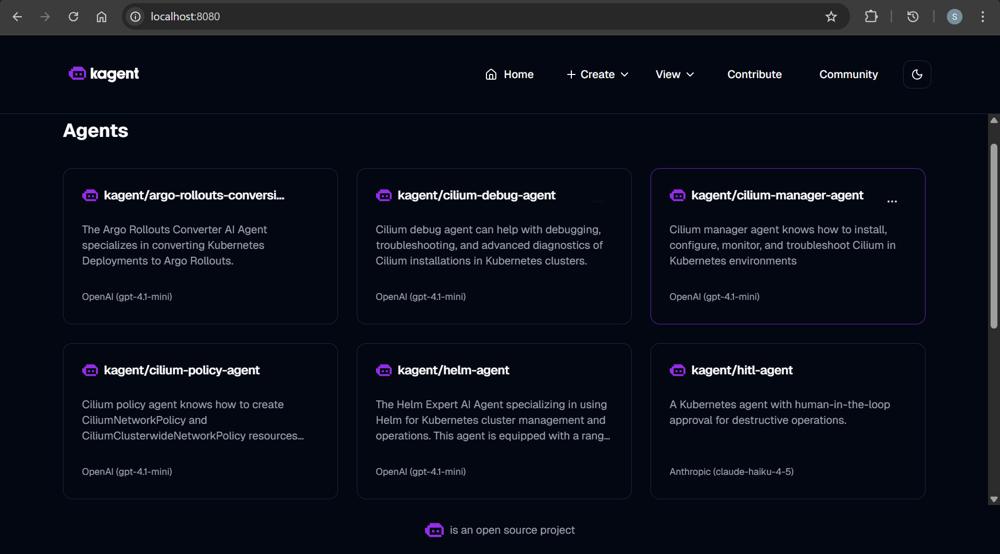

# Kubetriage: Kagent Installation

[Back](../../README.md)

---

## Installation

- Install kagent

```sh
export OPENAI_API_KEY="your-api-key-here"
kubectl create ns kagent
# namespace/kagent created

curl https://raw.githubusercontent.com/kagent-dev/kagent/refs/heads/main/scripts/get-kagent | bash
#   % Total    % Received % Xferd  Average Speed   Time    Time     Time  Current
#                                  Dload  Upload   Total   Spent    Left  Speed
# 100  9579  100  9579    0     0  31902      0 --:--:-- --:--:-- --:--:-- 32036
# kagent v0.8.3 is available. Changing from version 0.8.3.
# Downloading https://cr.kagent.dev/v0.8.3/kagent-linux-amd64
# Verifying checksum... Done.
# Preparing to install kagent into /usr/local/bin
# kagent installed into /usr/local/bin/kagent

# confirm
kagent version
# {"backend_version":"unknown","build_date":"2026-03-31","git_commit":"e06146b","kagent_version":"0.8.3"}

# install kagent with demo profile
kagent install --profile demo
# kagent installed successfully

# kagent dashboard (UI)
kagent dashboard
# Dashboard is not available on this platform
# You can easily start the dashboard by running:
# kubectl port-forward -n kagent service/kagent-ui 8082:8080
# and then opening http://localhost:8082 in your browser
```

- Human-in-the-Loop with kagent

```sh
kubectl apply -f 02_kagent/manifests/hitl-agent.yaml
# agent.kagent.dev/hitl-agent created

# Port-forward the kagent dashboard
kubectl port-forward -n kagent svc/kagent-ui 8080:8080
```


