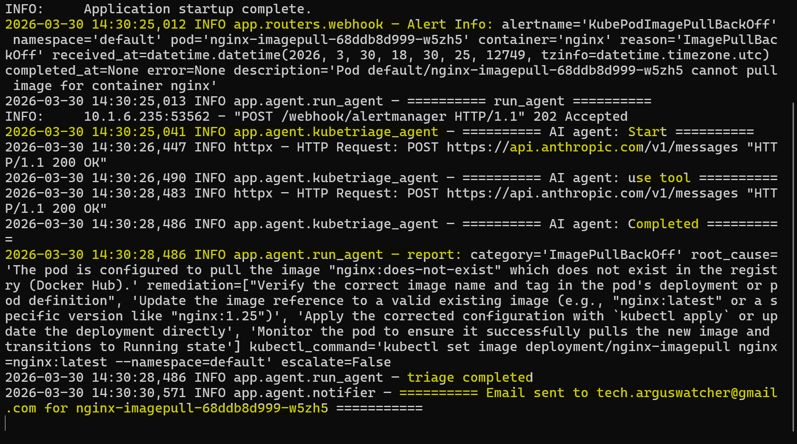
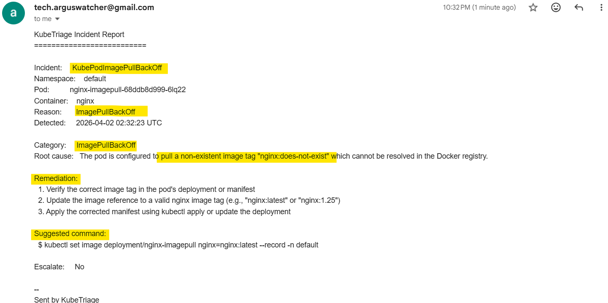
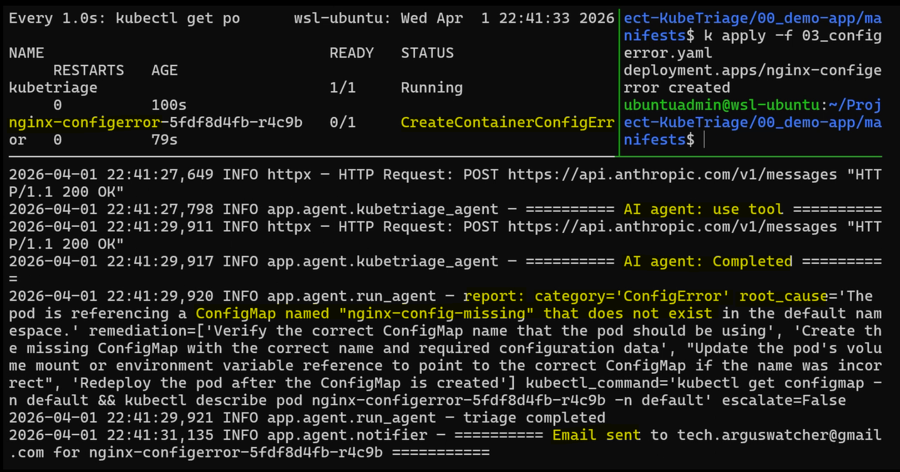
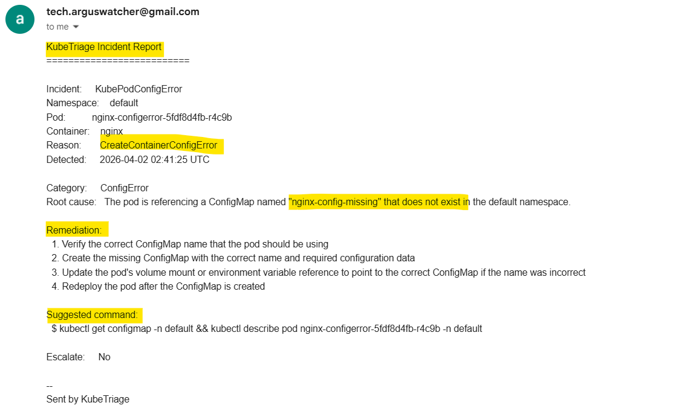
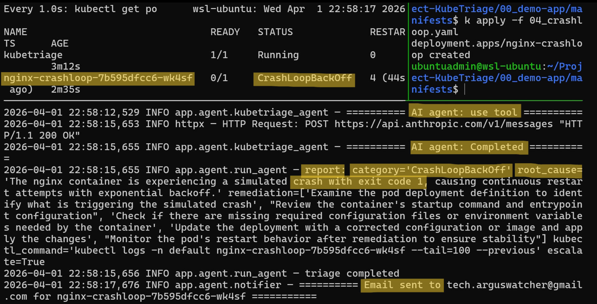
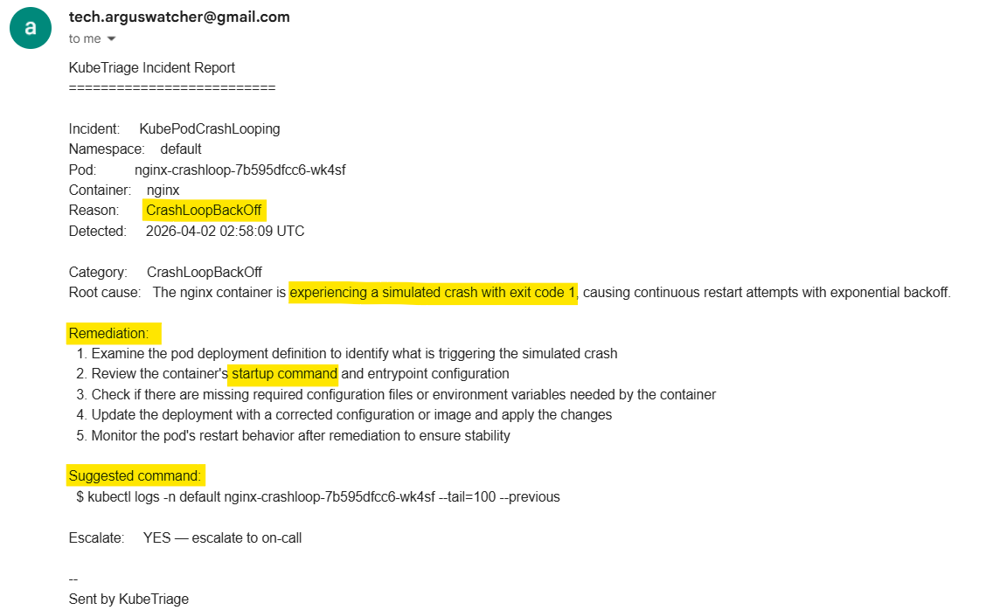

# KubeTriage: Custom AI Agent — Function Calling Demo

[Back](../../README.md)

- [KubeTriage: Custom AI Agent — Function Calling Demo](#kubetriage-custom-ai-agent--function-calling-demo)
  - [Intro](#intro)
  - [Function Calling Demo](#function-calling-demo)
    - [ImagePullBackOff](#imagepullbackoff)
    - [ConfigMap Error](#configmap-error)
    - [CrashLoopBackOff](#crashloopbackoff)

---

## Intro

- The agent runs inside the cluster and responds automatically to Grafana Alertmanager webhooks.
- On alert, it collects logs via predefined function calls, generates an RCA report using the
- Anthropic API, and emails the on-call engineer — no human prompt required.


---

## Function Calling Demo

- Deploy the KubeTriage agent (FastAPI webhook receiver + function-calling agent)

```sh
kubectl apply -f 03_agent-function-calling/manifests
```

---

### ImagePullBackOff

Simulates a deployment referencing a non-existent image tag, triggering an `ImagePullBackOff` error.

```sh
kubectl apply -f 00_demo-app/manifests/02_imagepull.yaml
# deployment.apps/nginx-imagepull created
```

- **Agent Logs** — function calls invoked and RCA report generated



- **Notification Email**



---

### ConfigMap Error

Simulates a deployment referencing a non-existent ConfigMap, triggering an `CreateContainerConfigError` error.

```sh
kubectl apply -f 00_demo-app/manifests/03_configerror.yaml
# deployment.apps/nginx-configerror created
```

- **Agent Logs** — function calls invoked and RCA report generated



- **Notification Email**



---

### CrashLoopBackOff

Simulates a deployment executing `exit 1`, triggering a `CrashLoopBackOff` error.

```sh
kubectl apply -f 00_demo-app/manifests/04_crashloop.yaml
# deployment.apps/nginx-crashloop created
```

- **Agent Logs** — function calls invoked and RCA report generated



- **Notification Email**


