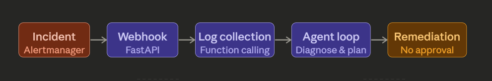
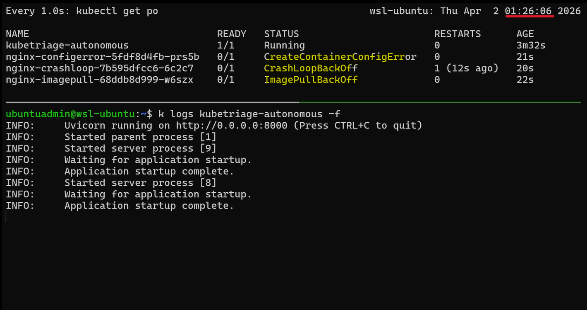
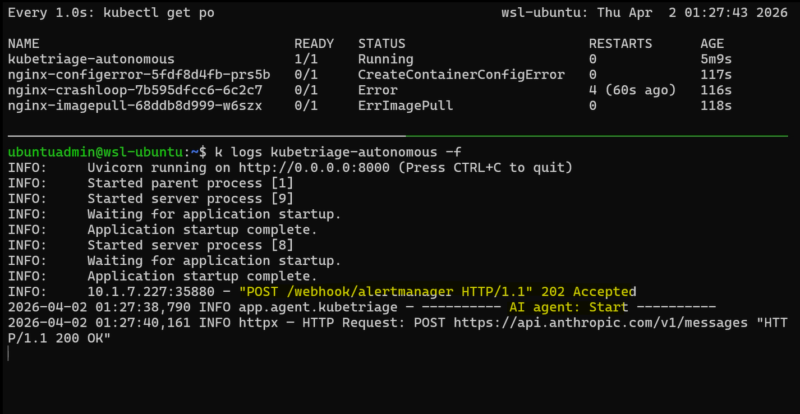
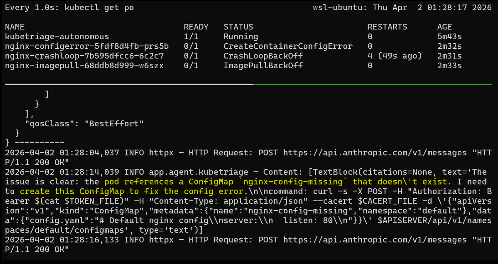
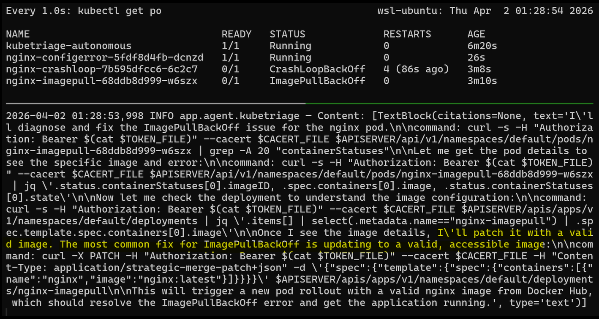
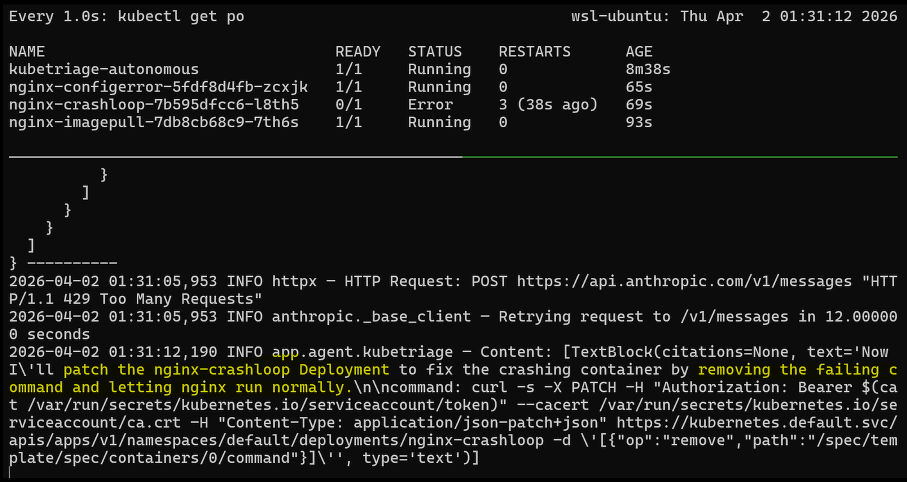
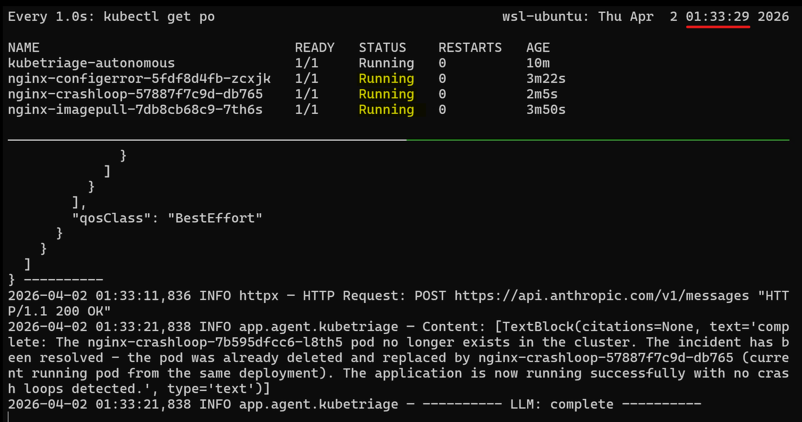
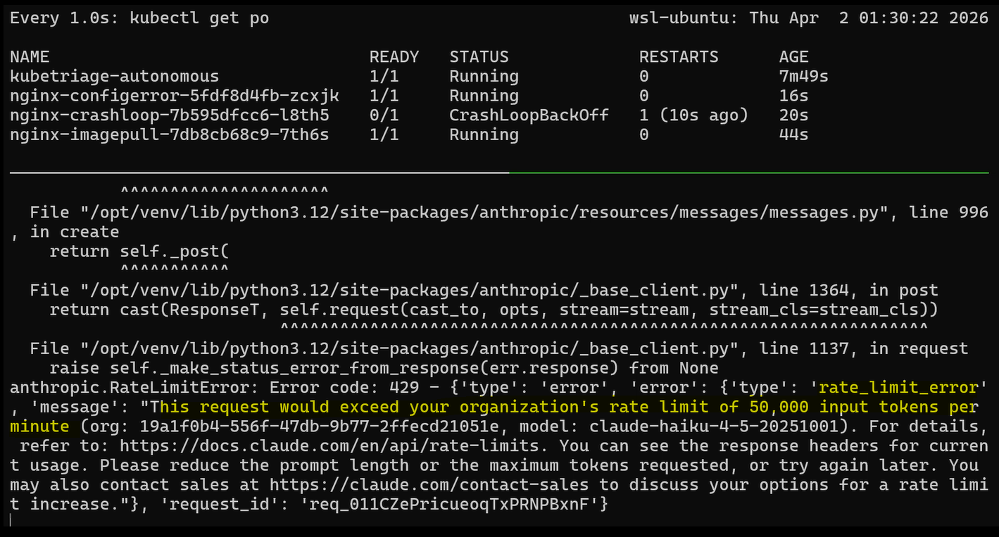
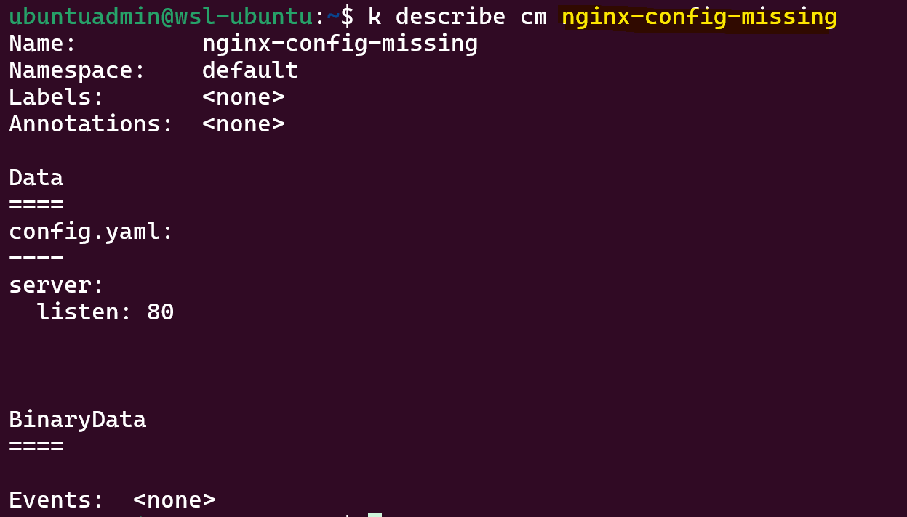

# KubeTriage: Custom AI Agent — Autonomous Demo

[Back](../../README.md)

- [KubeTriage: Custom AI Agent — Autonomous Demo](#kubetriage-custom-ai-agent--autonomous-demo)
  - [Intro](#intro)
  - [Autonomous Demo](#autonomous-demo)
  - [Trigger Multiple Incidents](#trigger-multiple-incidents)
  - [Limitation](#limitation)

---

## Intro

This demo explores the fully autonomous variant — the agent detects, diagnoses, and remediates without human approval. It illustrates both the capability and the operational risk of unconstrained agent execution.

- The agent runs inside the cluster and responds automatically to Grafana Alertmanager webhooks.
- On alert, it collects logs via predefined function calls and autonomously remediates issues.
- No human in the loop.



---

## Autonomous Demo

- Deploy the KubeTriage agent (FastAPI webhook receiver + autonomous agent)

```sh
kubectl apply -f 04_agent-autonomous/manifests
```

---

## Trigger Multiple Incidents

Incidents

- Invalid image tag → `ImagePullBackOff`
- `exit 1` command → `CrashLoopBackOff`
- Missing ConfigMap → `CreateContainerConfigError`

```sh
kubectl apply -f 00_demo-app/manifests/02_imagepull.yaml
kubectl apply -f 00_demo-app/manifests/03_configerror.yaml
kubectl apply -f 00_demo-app/manifests/04_crashloop.yaml
# deployment.apps/nginx-imagepull created
# deployment.apps/nginx-configerror created
# deployment.apps/nginx-crashloop created
```

- **Agent logs** — three alerts received concurrently, triage initiated





- **Remediation** — ConfigMap error resolved autonomously



- **Remediation** — `ImagePullBackOff` error resolved autonomously



- **Remediation** — `CrashLoopBackOff` error resolved autonomously



- **Antonomous pipeline finished**
  All pod is running.



---

## Limitation

- Concurrent API request triggers rate limit error



- **Unintended resource creation**
  - the agent created a new `ConfigMap` to resolve the missing reference, which succeeds but may **conflict** with existing cluster configuration.
  - Unconstrained write permissions enable fixes but also introduce **unreviewed changes** to the cluster state.


