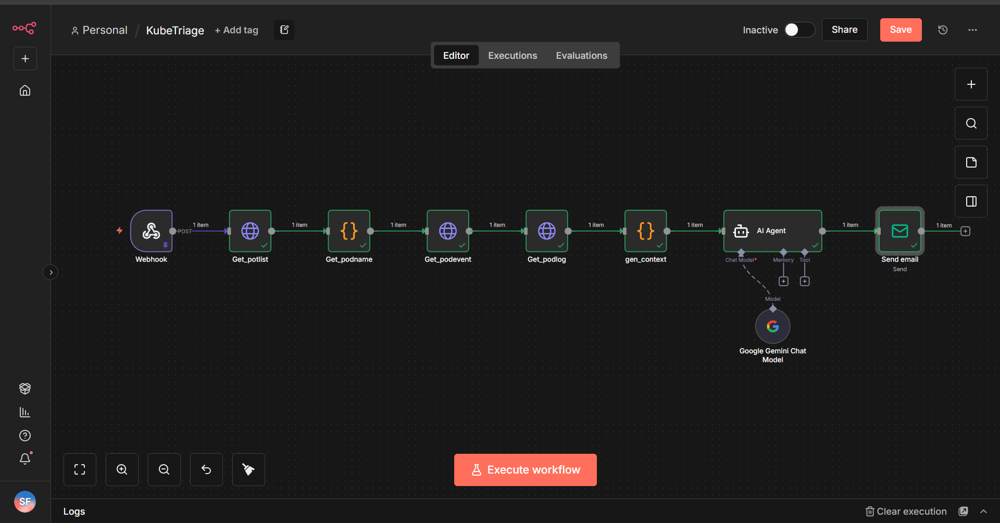
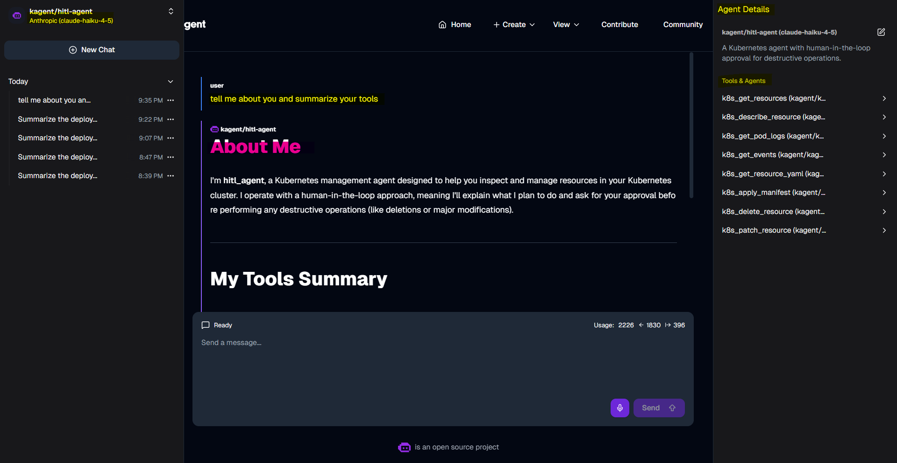
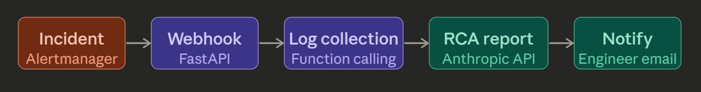

# KubeTriage: AI-Assisted Kubernetes Incident Triage

> Exploring AI agent integration for Kubernetes incident triage — from PoC to a functional end-to-end pipeline.

- [KubeTriage: AI-Assisted Kubernetes Incident Triage](#kubetriage-ai-assisted-kubernetes-incident-triage)
  - [Problem](#problem)
  - [Approach](#approach)
    - [Traditional Pipeline](#traditional-pipeline)
    - [AI-Augmented Pipeline](#ai-augmented-pipeline)
  - [Implementation](#implementation)
    - [Phase 1 — Proof of Concept: n8n Workflow](#phase-1--proof-of-concept-n8n-workflow)
    - [Phase 2 — Framework Exploration: `Kagent`](#phase-2--framework-exploration-kagent)
    - [Phase 3 — Custom Agent Pipeline](#phase-3--custom-agent-pipeline)
  - [Key Takeaways](#key-takeaways)

---

## Problem

Kubernetes incident response relies on manual log inspection, creating bottlenecks in the triage pipeline and inflating MTTR.

AI agents offer a path to automated log analysis and `RCA(Root Cause Analysis)` summarization — but introducing autonomous agents
into a production cluster raises questions around safety, RBAC scoping, and human oversight.

This project explores how to integrate AI agents into a Kubernetes triage pipeline, and evaluates the tradeoff between agent autonomy and operational risk.

---

## Approach

### Traditional Pipeline

`Incident → Alert → Manual log inspection → Root cause identification → Mitigation`

- The `diagnosis phase` is the primary bottleneck — engineers manually extract signal from high-volume, unstructured logs across distributed pods, inflating MTTR.

---

### AI-Augmented Pipeline

`Incident → Alert → AI agent log analysis + RCA report → Human verification → Mitigation`

- AI handles log triage and root cause summarization.
- The human engineer retains approval authority before any remediation — preserving oversight while eliminating the manual diagnosis bottleneck.

---

## Implementation

Three progressive phases, each building on insights from the previous.

### Phase 1 — Proof of Concept: n8n Workflow

- **Goal**: Validate the **AI-augmented triage pipeline concept** without custom code
- **Environment**: `minikube`
- **Tools**: `ArgoCD`, `n8x`, `Anthropic API`
- **Outcome**: Pipeline executed end-to-end as designed
- **Limitation**: `n8n` is a general-purpose workflow tool — deploying it inside the cluster solely for triage introduces unrelated infrastructure overhead (PostgreSQL, persistent volumes, ingress)

- **Diagram**: n8n Workflow

- [PoC Demo](./01_n8n/docs/n8n_demo.md)
- [n8n Workflow](./01_n8n/docs/n8n_workflow.md)

---

### Phase 2 — Framework Exploration: `Kagent`

- **Goal**: Evaluate a **Kubernetes-native AI agent framework** (CNCF Sandbox project)
- **Environment**: `kubernetes in Docker Desktop`
- **Tools**: `Kagent`, `Anthropic API`
- **Outcome**: `Kagent` provides native `human-in-the-loop` approval gates before agents execute production actions
- **Limitation**: `Kagent` does not provide an end-to-end triage pipeline out of the box — additional microservices (webhook receiver, notifier) are required to complete the pipeline

- [Kagent Demo](./02_kagent/docs/kagent_demo.md)
- [Kagent Installation](./02_kagent/docs/kagent_install.md)

---

### Phase 3 — Custom Agent Pipeline

- **Goal**: Implement a functional end-to-end triage pipeline with full control over agent scope and permissions
- **Environment**: `kubernetes in Docker Desktop`
- **Tools**: `Grafana Alertmanager`, `FastAPI`, `Anthropic API`
- **Architecture Diagram** - Function Calling
  

- **Key finding**:
  Agent capability and operational risk are directly governed by RBAC scope and tool permissions
  - Read-only service account + predefined functions → constrained, human-in-the-loop pipeline
  - Privileged role + unconstrained prompts → unsafe autonomous execution
- **Known limitation**:
  - Concurrent alerts can exhaust LLM API rate limits — production deployments would require a request queue, as provided by frameworks such as LangChain

---

## Key Takeaways

- **Log triage is the primary MTTR bottleneck** — AI agents can automate RCA report generation, reducing manual diagnosis burden on on-call engineers
- **Agent autonomy and operational risk are coupled** — RBAC scope, service account permissions, and tool constraints are the primary levers for safe agent design
- **Human-in-the-loop is not optional in production** — function calling with predefined tools is safer than fully autonomous agents operating on a live cluster
- **Kagent (CNCF Sandbox) shows promise** but requires additional orchestration layers for end-to-end integration — maturity should be monitored as the project evolves
